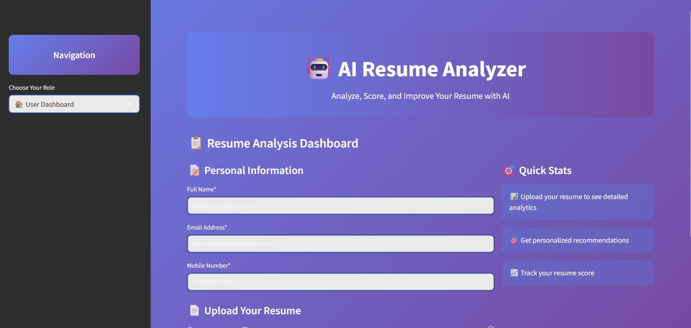
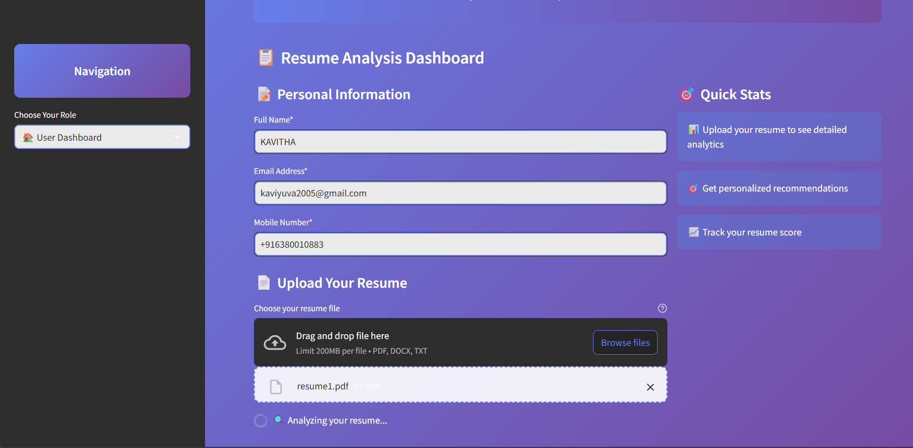
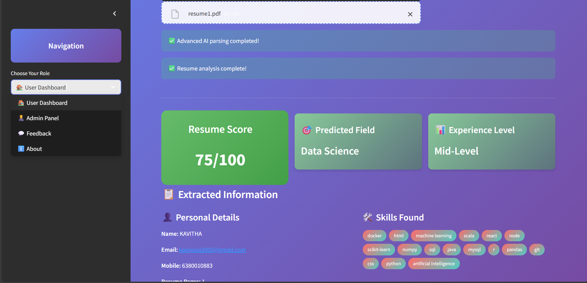
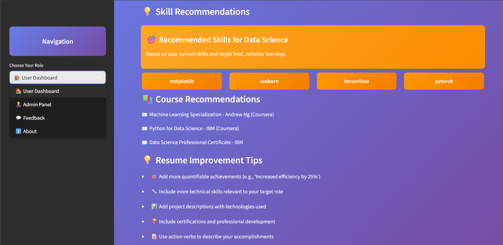
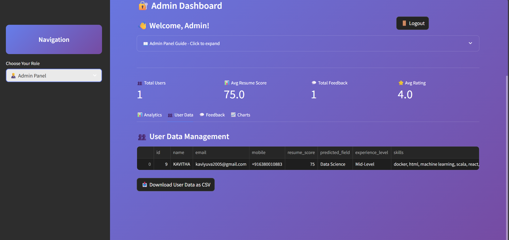
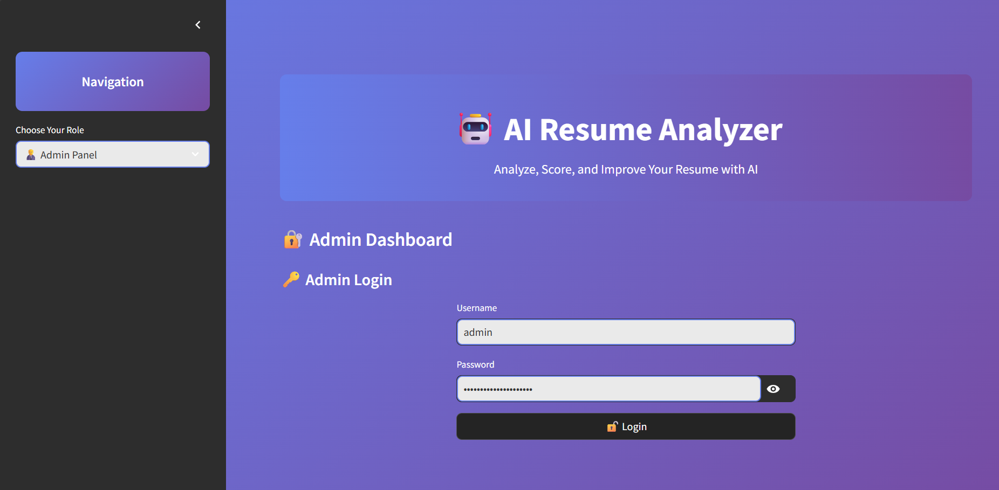
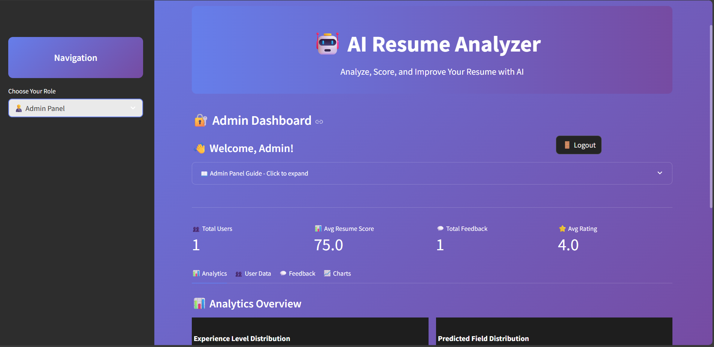
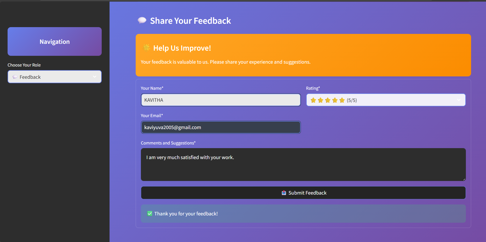

# 🤖 AI Resume Analyzer - Enhanced Version

<div align="center">
  
  
  
  

</div>

<br/>

<div align="center">
  <h3>🚀 AI-Powered Resume Analysis & Career Enhancement Tool</h3>
  <p>Analyze, Score, and Improve Your Resume with Advanced AI Technology</p>
  <p><strong>✨ Now with Professional UI, Admin Dashboard, and Enhanced Analytics! ✨</strong></p>
</div>

## 📸 **Application Screenshots**

### 🏠 **Main Dashboard**
<div align="center">
  
  <p><em>Beautiful gradient design with professional purple/violet theme</em></p>
</div>

### 📄 **Resume Upload & Analysis**
<div align="center">
  
  <p><em>Easy-to-use upload interface with personal information form</em></p>
</div>

<div align="center">
  
  <p><em>Comprehensive analysis with scoring, field prediction, and skill extraction</em></p>
</div>

### 💡 **AI-Powered Recommendations**
<div align="center">
  
  <p><em>Personalized skill recommendations and course suggestions</em></p>
</div>

### 👨‍💼 **Admin Dashboard**
<div align="center">
  
  <p><em>Secure admin authentication system</em></p>
</div>

<div align="center">
  
  <p><em>Comprehensive admin panel with analytics and user management</em></p>
</div>

<div align="center">
  
  <p><em>Interactive charts and data visualizations</em></p>
</div>

### 💬 **Feedback System**
<div align="center">
  
  <p><em>User feedback collection with star ratings and comments</em></p>
</div>

## 🌟 New Features & Improvements

### 🎨 **Professional UI Redesign**
- **Modern Gradient Design**: Beautiful purple/violet gradient theme (avoiding blue colors)
- **Responsive Layout**: Optimized for all screen sizes with professional styling
- **Interactive Components**: Enhanced user experience with gradient cards and modern typography
- **Custom CSS**: Polished interface with professional color schemes

### 🔧 **Enhanced Functionality**
- **Smart Resume Parsing**: Advanced text extraction with multiple format support (PDF, DOCX, TXT)
- **AI-Powered Analysis**: Intelligent skill detection and job field prediction
- **Resume Scoring**: Comprehensive 100-point scoring system based on multiple criteria
- **Experience Level Detection**: Automatic classification (Fresher/Junior/Mid-Level/Senior)
- **Personalized Recommendations**: Tailored skill and course suggestions

### 👨‍💼 **Admin Dashboard**
- **Secure Authentication**: Admin login system (Username: admin, Password: admin@resume-analyzer)
- **User Analytics**: Comprehensive user data management and visualization
- **Interactive Charts**: Data visualizations with Plotly integration (with fallback options)
- **CSV Export**: Download user data for external analysis
- **Real-time Metrics**: Live dashboard with key performance indicators

### 💬 **Feedback System**
- **User Ratings**: 5-star rating system for user satisfaction
- **Comment Collection**: Detailed feedback collection from users
- **Analytics Integration**: Feedback data visualization and analysis

### 🗄️ **Database Integration**
- **SQLite Backend**: Lightweight, efficient data storage
- **User Tracking**: Complete user journey analytics
- **Data Persistence**: Secure data storage and retrieval

## 🚀 Quick Start

### Prerequisites
- Python 3.8 or higher
- pip package manager

### Installation

1. **Clone the repository**
   ```bash
   git clone https://github.com/your-username/AI-Resume-Analyzer.git
   cd AI-Resume-Analyzer
   ```

2. **Install required packages**
   ```bash
   pip install streamlit pandas plotly spacy nltk pdfminer.six docx2txt python-dateutil geocoder geopy
   ```

3. **Download spaCy English model**
   ```bash
   python -m spacy download en_core_web_sm
   ```

4. **Run the application**
   ```bash
   cd App
   streamlit run App.py
   ```

5. **Access the application**
   Open your browser and go to `http://localhost:8501`

## 📋 Features Overview

### 🏠 User Dashboard
- **Personal Information Input**: Name, email, and contact details
- **Resume Upload**: Support for PDF, DOCX, and TXT formats
- **Real-time Analysis**: Instant resume processing and analysis
- **Comprehensive Results**: Detailed breakdown of resume components
- **Skill Visualization**: Interactive display of detected skills
- **Recommendations**: Personalized suggestions for improvement

### 📊 Analysis Features
- **Resume Score**: 100-point scoring system based on:
  - Basic information completeness (20 points)
  - Skills diversity and relevance (30 points)
  - Content quality and length (30 points)
  - Professional keywords usage (20 points)

- **Job Field Prediction**: AI-powered prediction of target career field
- **Experience Level Assessment**: Automatic classification based on skills and content
- **Skill Recommendations**: Suggestions for skills to learn based on target field

### 👨‍💼 Admin Features
- **User Management**: View and manage all user data
- **Analytics Dashboard**: Comprehensive data visualization
- **Export Functionality**: Download data in CSV format
- **Feedback Management**: View and analyze user feedback

## 🛠️ Technology Stack

### Frontend
- **Streamlit**: Interactive web application framework
- **Custom CSS**: Professional styling and responsive design
- **Plotly**: Interactive data visualizations (with fallback options)

### Backend
- **Python**: Core application logic
- **spaCy**: Natural language processing for text analysis
- **SQLite**: Lightweight database for data storage
- **NLTK**: Additional text processing capabilities

### AI/ML Components
- **Text Extraction**: Multi-format document parsing
- **Skill Detection**: Keyword-based skill identification
- **Field Prediction**: Rule-based job field classification
- **Scoring Algorithm**: Multi-criteria resume evaluation

## 📁 Project Structure

```
AI-Resume-Analyzer/
├── App/
│   ├── App.py                 # Main Streamlit application
│   └── requirements.txt       # Python dependencies
├── pyresparser/
│   ├── __init__.py           # Package initialization
│   ├── resume_parser.py      # Resume parsing logic
│   ├── utils.py              # Utility functions
│   └── constants.py          # Constants and configurations
├── sample_resume.txt         # Sample resume for testing
├── README.md                 # Original documentation
├── README.md        # This enhanced documentation

```

## 🎯 Usage Guide

### For Users
1. **Navigate to User Dashboard**: Select "🏠 User Dashboard" from the sidebar
2. **Enter Personal Information**: Fill in your name, email, and mobile number
3. **Upload Resume**: Choose your resume file (PDF, DOCX, or TXT)
4. **View Analysis**: Get instant analysis with score, predictions, and recommendations
5. **Apply Suggestions**: Use the recommendations to improve your resume

### For Administrators
1. **Access Admin Panel**: Select "👨‍💼 Admin Panel" from the sidebar
2. **Login**: Use credentials (admin / admin@resume-analyzer)
3. **View Analytics**: Explore user data and analytics
4. **Export Data**: Download user data for external analysis
5. **Manage Feedback**: Review user feedback and ratings

## 🔧 Configuration

### Admin Credentials
- **Username**: admin
- **Password**: admin@resume-analyzer

### Database
- **Type**: SQLite
- **File**: resume_analyzer.db (created automatically)
- **Tables**: users, feedback

## 🤝 Contributing

Contributions are welcome! Please feel free to submit a Pull Request.


## 🙏 Acknowledgments

- Original project inspiration from resume analysis research
- spaCy team for excellent NLP capabilities
- Streamlit team for the amazing web framework
- Open source community for various libraries and tools

## 📞 Support

If you encounter any issues or have questions, please:
1. Use the feedback system within the application
2. Create an issue on GitHub
3. Check the documentation for troubleshooting tips

---

<div align="center">
  <p>🤖 AI Resume Analyzer - Empowering careers through intelligent analysis</p>
  <p>Built with ❤️ using Python, Streamlit, and AI</p>
</div>
